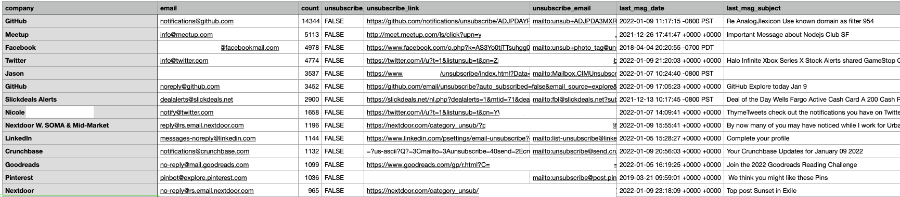

<p align="center">
  <a href="https://github.com/AnalogJ/hatchet">
  
  </a>
</p>

# hatchet
Cut down spam in your Gmail Inbox




# Introduction

Hatchet is a tool to help you manage/prune your Email Inbox.
As it processes your inbox, it will keep track the unique sender email addresses and the number of emails from each sender. 
It will also search the email headers and body for "unsubscribe" links.

Once Hatchet finishes its work, it will generate a spreadsheet that you can use to quickly unsubscribe from the most annoying mailing lists spamming your inbox. 

# Getting Started

```

go run cmd/hatchet/hatchet.go report \
    --imap-hostname=imap.gmail.com \
    --imap-username=xxxxx@gmail.com \
    --imap-password=xxxxxxx

```


# Versioning
We use SemVer for versioning. For the versions available, see the tags on this repository.

# Authors
Jason Kulatunga - Initial Development - @AnalogJ

# License

- MIT
- [Logo: Hatchet by Fran Couto from NounProject.com](https://thenounproject.com/icon/hatchet-3263047/)

